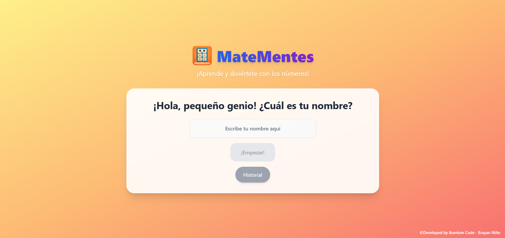
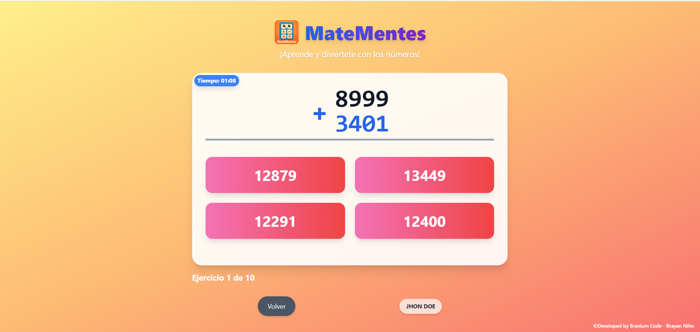
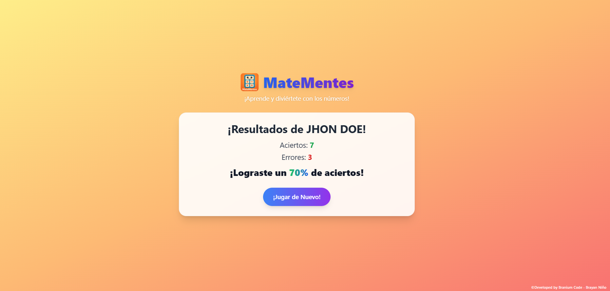

# 📚 MateMentes 🧠➕✖️➗➖

**MateMentes** es una aplicación web interactiva diseñada para que niños y niñas practiquen, desarrollen y fortalezcan sus habilidades matemáticas de forma divertida y adaptada a diferentes niveles de dificultad. Su diseño está optimizado para dispositivos móviles y ordenadores, con una interfaz amigable y atractiva.

---

## 🚀 Características principales

- **Ejercicios dinámicos**: Suma, resta, multiplicación y división con formato visual claro.
- **Niveles de dificultad adaptativos**:
  - **Fácil**: Números hasta miles.
  - **Medio**: Números hasta decenas de mil (en multiplicación y división, solo en el multiplicando y dividendo).
  - **Difícil**: Números hasta centenas de mil (solo en multiplicación y división en el multiplicando y dividendo).
- **Interfaz optimizada para niños**: Diseño colorido, claro y atractivo.
- **Rondas de juego**:
  - Cada partida consta de **10 ejercicios**.
  - Se contabilizan aciertos y errores.
  - Al final se muestra un resumen con el total de respuestas correctas e incorrectas.
- **Compatibilidad multiplataforma**: Funciona tanto en dispositivos móviles como en ordenadores.
- **Contador de ejercicios**: Rondas de 10 ejercicios, con registro automático de aciertos y errores.
- **Retroalimentación inmediata**: Si el jugador falla, se muestra la solución paso a paso y la respuesta correcta.
- **Formato escolar**: Presentación de las operaciones siguiendo el formato de escritura tradicional.
- **Historial de usuarios**:
  - Muestra los **últimos 10 jugadores** que han jugado.
  - Se comparan sus resultados (aciertos y errores) para fomentar la competitividad amistosa.
- **Adaptación a móvil**:
  - Diseño optimizado para pantallas pequeñas.
  - Ajuste dinámico del tamaño de los números para que no se desborden del contenedor.

---

## 📱 Funcionalidades destacadas

1. **Selección de operación y dificultad**
   - Suma, resta, multiplicación o división.
   - Ajuste de dificultad antes de iniciar.

2. **Contador de progreso**
   - Muestra el ejercicio actual y el total (Ej.: "Ejercicio 3 de 10").
   - Incrementa automáticamente tanto en aciertos como en errores.

3. **Modo adaptado a móvil**
   - Escalado automático del tamaño de los números para evitar que se salgan del contenedor.
   - Resultados largos en formato bloque para mejorar la visibilidad.

4. **Final de ronda**
   - Muestra resumen de aciertos y errores.
   - Opción para iniciar una nueva ronda.

---

## 🎯 Objetivo educativo

MateMentes busca que el aprendizaje de las matemáticas sea dinámico y motivador, ayudando a los niños a mejorar su agilidad mental y reforzar sus conocimientos básicos.

## 🌐 Enlace a la aplicación

🔗 [Probar MateMentes](https://matementes.netlify.app/)

---

## 📷 Capturas y ejemplo de uso

*(Aquí puedes añadir capturas reales de la app)*

---

Desarrollado con ❤️ para el aprendizaje de los más pequeños.
